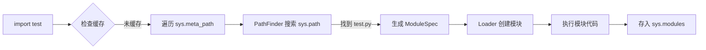

在 Python 中执行 import test 时，如果项目根目录存在 test.py 文件，Python 会通过 ModuleSpec 对象完成模块加载。以下是完整的导入过程解析：

一、ModuleSpec 的创建与组成
当 import test 执行时，Python 会生成如下 ModuleSpec 对象：
```python
ModuleSpec(
    name='test',                  # 模块名称
    loader=<_frozen_importlib_external.SourceFileLoader object>,  # 加载器
    origin='/path/to/your/project/test.py',  # 模块路径
    submodule_search_locations=None,        # 子模块搜索路径（仅包有）
    loader_state=None,            # 加载器内部状态
    is_package=False              # 是否为包
)
```


二、完整导入流程详解
Python 的模块导入机制分为 查找器（Finder） 和 加载器（Loader） 两个核心阶段：


阶段 1：查找器（Finder）工作流程
1.触发查找 当执行 import test 时，Python 首先检查 sys.modules 缓存：
```python
if 'test' in sys.modules:
   return sys.modules['test']  # 直接返回已缓存模块
```
2.遍历元路径（Meta Path） 若未缓存，则遍历 sys.meta_path 中的所有查找器：
```plaintext
# 默认 sys.meta_path 包含三个查找器：
[
  <class '_frozen_importlib.BuiltinImporter'>,      # 处理内置模块
  <class '_frozen_importlib.FrozenImporter'>,       # 处理冻结模块
  <class '_frozen_importlib_external.PathFinder'>  # 处理文件系统模块
]
```
3.路径查找器（PathFinder）工作 对于文件系统模块，PathFinder 会：

1. 检查 sys.path 中的路径列表
2. 在路径中搜索 test.py 或 test/__init__.py
3. 找到后生成 ModuleSpec


阶段 2：加载器（Loader）工作流程
1.创建空模块对象 根据 ModuleSpec 创建一个空模块：
```python
module = spec.loader.create_module(spec)
```
2.执行模块代码 使用 SourceFileLoader 加载并执行代码：
```python
   spec.loader.exec_module(module)
   # 等效于：
   with open(spec.origin, 'r') as f:
       code = compile(f.read(), spec.origin, 'exec')
   exec(code, module.__dict__)  # 在模块命名空间执行
```
3.缓存模块 将模块存入 sys.modules：
```python
sys.modules['test'] = module
```


三、关键对象关系图


四、核心技术细节
1. 模块查找优先级
Python 按以下顺序搜索模块：
1. 内置模块（如 sys, math）
2. sys.path 中的目录（包含当前目录、PYTHONPATH 等）
3. .pth 文件定义的路径
2. 模块类型判断
- 普通模块（.py）：由 SourceFileLoader 处理
- 包模块（含 __init__.py）：is_package=True，submodule_search_locations 设为包目录
- C 扩展模块（.so/.pyd）：由 ExtensionFileLoader 处理
3. 自定义导入器示例
```python
import importlib.abc

class MyFinder(importlib.abc.MetaPathFinder):
    def find_spec(self, fullname, path, target=None):
        if fullname == 'test':
            return importlib.util.spec_from_loader(
                'test', 
                MyLoader(), 
                origin='virtual://test'
            )

class MyLoader(importlib.abc.Loader):
    def create_module(self, spec):
        return None  # 使用默认模块创建方式

    def exec_module(self, module):
        module.__dict__['hello'] = lambda: "Hello from virtual module"

# 注册自定义查找器
import sys
sys.meta_path.insert(0, MyFinder())

# 使用
import test
print(test.hello())  # 输出: Hello from virtual module
```


五、调试与验证
查看 ModuleSpec
```python
import importlib.util

spec = importlib.util.find_spec('test')
print(spec)
# 输出: ModuleSpec(name='test', loader=<...>, origin='/path/to/test.py')
```
查看导入路径
```python
import test
print(test.__file__)  # 输出: /path/to/test.py
print(test.__spec__)  # 输出: 对应的 ModuleSpec 对象
```

六、注意事项

1. 相对导入问题 

   如果在包内使用相对导入（如 from . import submodule），需确保 __package__ 属性正确设置

2. 循环导入

   Python 通过部分初始化模块解决循环导入，但可能导致变量未定义错误

3. 修改代码重载

   使用 importlib.reload(test) 可重新加载模块，但可能引发状态不一致问题

4. PYTHONPATH 影响

   修改 sys.path 可动态改变模块搜索路径：
```python
   import sys
   sys.path.append('/new/path')
```